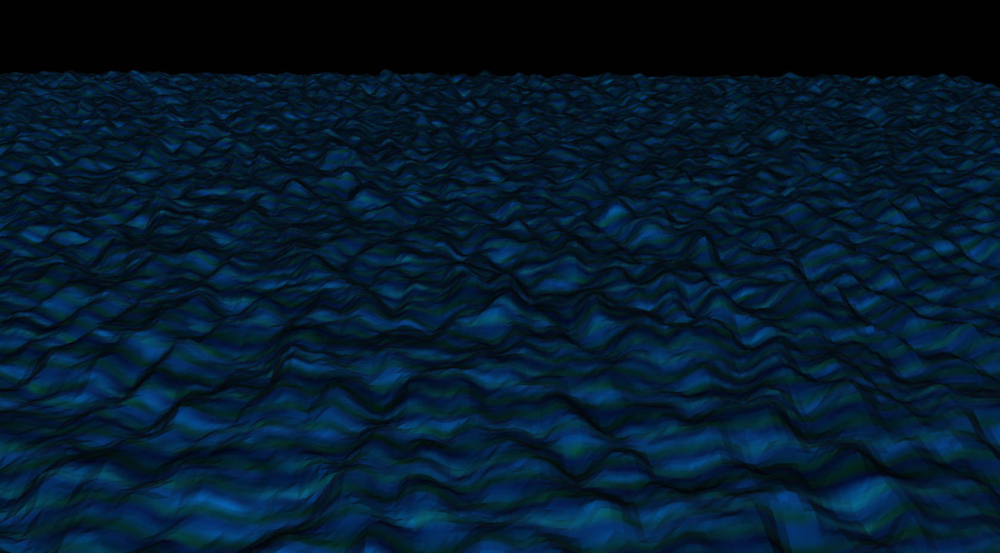
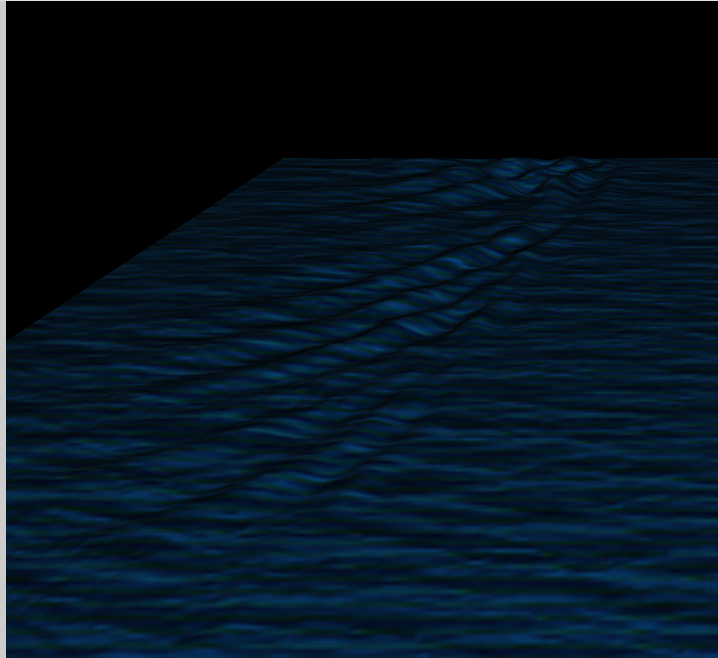
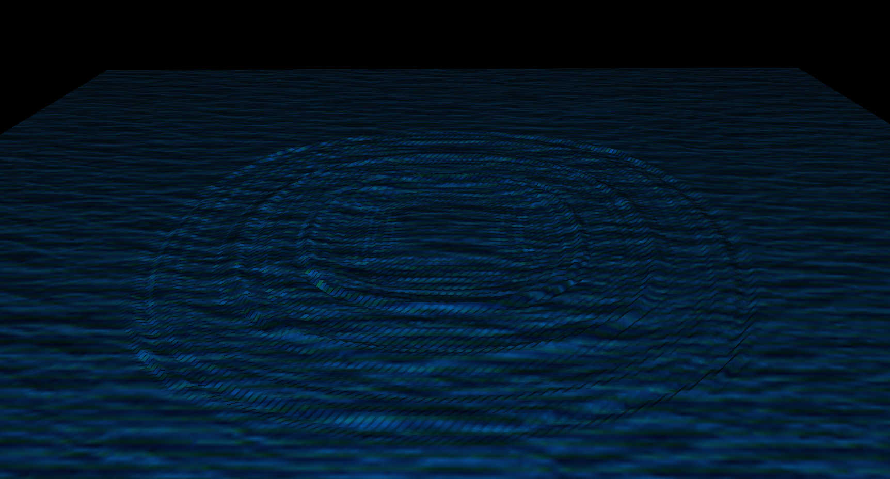

# Water Physics Project - OpenGL Course - Daniel Rosa IMAGE2024




## Usage

To compile and run the program, use the following commands:

1. Clean the build directory (optional):
    ```
    make clean
    ```

2. Compile the program:
    ```
    make
    ```

3. Run the program:
    ```
    ./program
    ```

